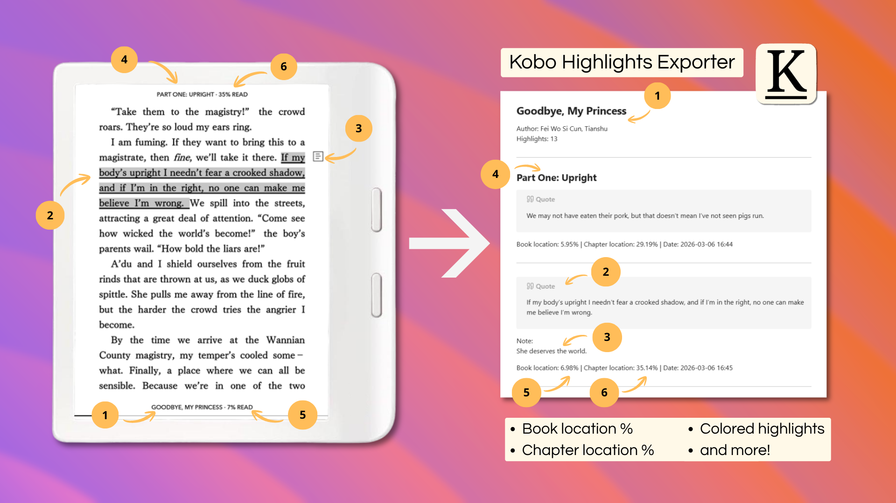
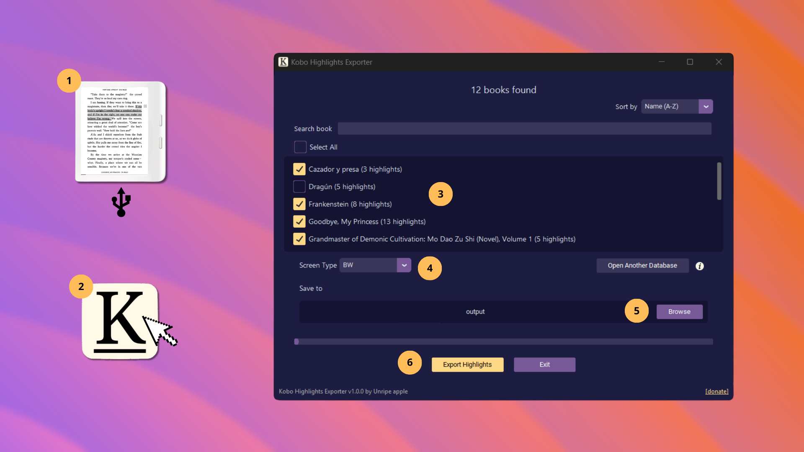
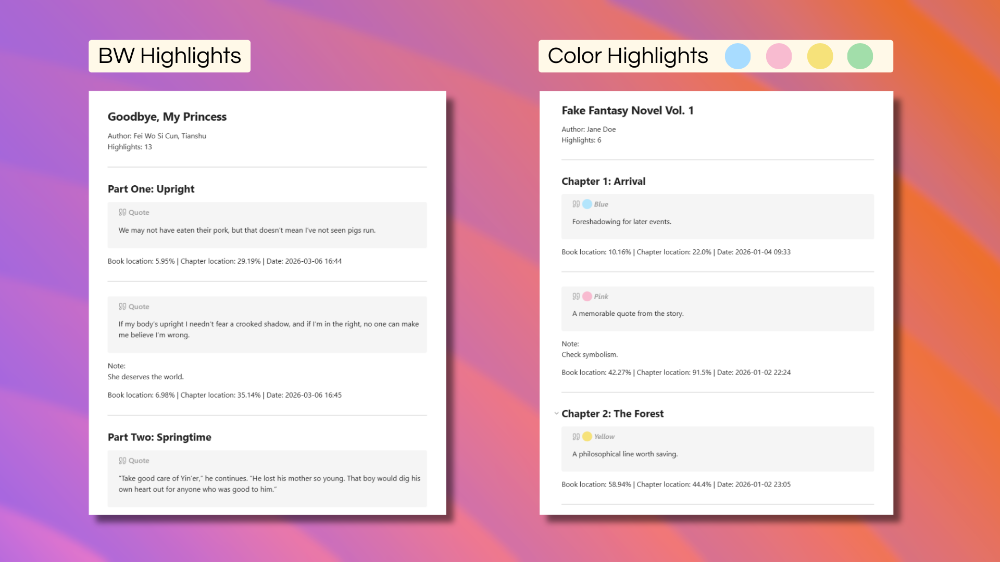
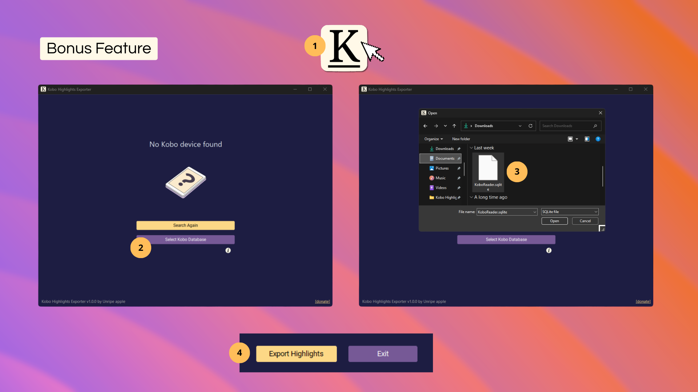
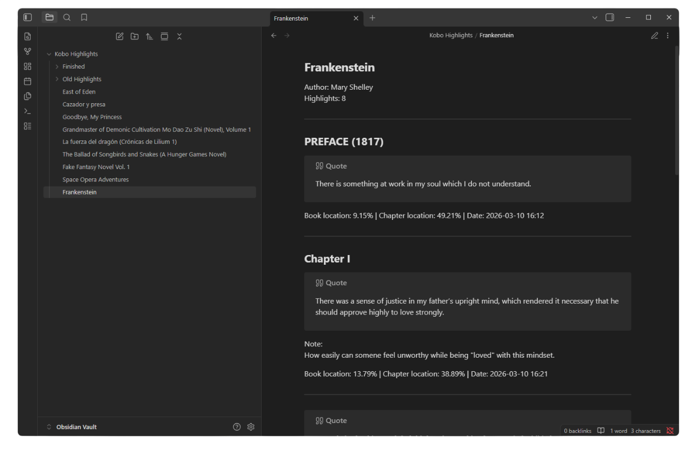

# 📕📥 Kobo Highlights Exporter

Extract and export highlights and notes from your Kobo eReader into a Markdown file.

  
  

<h2>📑 Table of Contents</h2>

- [🎯 Why Kobo Highlights Exporter](#-why-kobo-highlights-exporter)
- [💡 Usage](#-usage)
- [🌟 Features](#-features)
- [⚙️ Installation](#%EF%B8%8F-installation)
- [🪄 How It Works](#-how-it-works)
- [✅ Supported Devices](#-supported-devices)
- [✨ Recommended Markdown Viewer](#-recommended-markdown-viewer)
- [💗 Support](#-support)
- [🛡️ Privacy](#%EF%B8%8F-privacy)
- [🧾 License](#-license)

## 🎯 Why Kobo Highlights Exporter

Other exporter tools, including the official one, are either limited or paid (or both!). And something important is always missing:

❌ No book location per highlight (Important if you later reference the physical book!)  
❌ Unreliable chapter location (if any)  
❌ Missing or broken chapter titles  
❌ Frequent issues with sideloaded books (discrimination! 🙈)  
❌ Possible fees   

How Kobo Highlights Exporter does it better

✅️ Precise book location (%)  
✅️ Precise chapter location (%)  
✅️ Correct chapter titles  
✅️ Supports most books  
✅️ Colored highlights supported  
✅️ Works offline  
✅️ Free!  

## 💡 Usage

1. Connect your Kobo eReader to your computer using a USB cable.
2. Launch the app — it will automatically detect your connected Kobo device.
3. Select the books you want to export highlights from.  You can search, sort, or select them all at once.
4. Choose your **Screen Type**: `BW` or `Color`.   (Select `Color` if your device supports color highlights.)
5. Choose the folder where the Markdown files will be saved.
6. Click **Export Highlights**.

Done! Now you have your highlights in a `Book Title.md` format for you to handle however you want.

  
  

## 🌟 Features

Kobo Highlights Exporter makes exporting your highlights and notes **fast, flexible and precise**.

- 🚀 Extract highlights text from Kobo database  
- 📝 Extract notes text from Kobo database
- 🔎Reads ebook TOC when database lack info
- 📚 Includes **book title** and **author** metadata  
- 🔢 Includes **number of highlights** 
- 📂 Export to **Markdown**  
- ⚡ Fast and lightweight  
- 🖥 Works offline

📊 What you can export from your books (besides highlights)

|       Book Type        | Book location (%) | Chapter location (%) | Chapter Titles | Notes | Date | Color |
| :--------------------: | :---------------: | :------------------: | :------------: | :---: | :--: | :---: |
|    Kobo Store book     |         ✅         |          ✅           |       ✅        |   ✅   |  ✅   |   ✅   |
| Overdrive (libby) loan |         ✅         |          ✅           |       ✅        |   ✅   |  ✅   |   ✅   |
|    Sideloaded KEPUB    |         ✅         |          ✅           |       ✅        |   ✅   |  ✅   |   ✅   |
|    Sideloaded EPUB     |         ✅         |          ❌           |       ✅        |   ✅   |  ✅   |   ✅   |
| Adobe Digital Editions |         ✅         |          ❌           |       ✅        |   ✅   |  ✅   |   ✅   |
>🛈 *Kobo's database treats EPUBs differently from KEPUBs, so chapter location (%) is not available for EPUBs.*   
>🛈 *PDF files are not supported.*

  
  

🎁 Bonus feature: Export from a friend's Kobo database!

Even if you **don’t have the device**, you can export highlights if your friend sends you a copy of their database (`KoboReader.sqlite` inside `.kobo`).

1. Run the app (no Kobo device needed)  
2. Click **"Browse for Kobo file"**  
3. Search for the copy of `KoboReader.sqlite` (must be named exactly)  
4. Export highlights normally

  
  

>🛈 Limitations for the bonus feature:
>- For **sideloaded books**, the database may lack correct chapter titles linked to the highlights, resulting in **'Unknown chapter'**.  In these cases, the app may need a **connected Kobo** to read the TOC directly from the book to find the real chapter title.
>- The tool is intended to work **optimally** when the Kobo device is connected.    
>- There are **no limitations** for **Kobo Store** and **Overdrive** books  👌

## ⚙️ Installation

Download the app from releases.

Kobo Highlights Exporter is available for:

- 🪟 **Windows**  
- 🍎 **macOS**  
- 🐧 **Linux**

## 🪄 How It Works

Kobo stores highlights in a **SQLite database** on the device: `.kobo/KoboReader.sqlite`

**Kobo Highlights Exporter** reads the database and extracts:

- Highlighted text  
- Notes  
- Book title  
- Author  
- Number of highlights per book  
- Book location %  
- Chapter location %  
- Color labels (for color device users)

> 🛈 Kobo Highlights Exporter **never** modifies your original database.  
> The app works with a **temporary copy**, so your Kobo device remains completely safe.

### Handling Sideloaded Books

Sideloaded books are **not as standardized** as Kobo Store books.  The database may store information inconsistently or in unusual formats. Examples include:

- Self-published books  
- Fan-made EPUBs  
- Long webnovels  
- Some publisher-provided EPUBs  

In these cases, Kobo Highlights Exporter **falls back to reading the TOC directly from the book** (if it’s stored on the device) to extract the missing information.

🖥️    ➔    🔍📄   ➔    ⚠️    ➔    🔍📖     ➔     ✅

### Handling Minor Database Issues 
  
Even “well-formatted” Kobo Store or Overdrive books can occasionally have:  
  
- Broken chapter titles  
  
When this happens, the tool uses an **additional fallback** to find and fix the missing info automatically.

🖥️     ➔     🔍📄    ➔     ⚠️     ➔     🔍 💡📄     ➔     ✅

### Summary  
  
Kobo Highlights Exporter **tries to look under every rock** for the information you need. It can **predict and fix most common errors on the fly**.    
  
> 🚨 Note: While the tool handles many edge cases, there is still a small margin for error.    
> If you encounter a problematic book, please **report the issue** so it can be improved.

## ✅ Supported Devices

Kobo Highlights Exporter works with **any Kobo eReader with firmware from 2014 or newer**.  

> ⚠️ It **might** work on older firmware versions, but compatibility is **not guaranteed**.

## ✨ Recommended Markdown Viewer

You can use **any Markdown viewer** to read and manage your highlights.  

However, if you don't have a favorite yet, I strongly recommend using [**Obsidian**](https://obsidian.md/) (the tool I personally use).

Why it works especially well:

- 📄 The exported Markdown files **look best in Obsidian**.
- 🎨 Supports the **HTML/CSS styling** used in the exports.
- 📚 You can create an **Obsidian Vault** and store all highlight files there.
- 🔄 No need to constantly import files.
- 📑 **Clean PDF export** directly from Obsidian.
- 🧠 If you keep the same Vault, Kobo Highlights Exporter **updates files with new highlights without creating duplicates**.

> ⚠️ **Note for Notion users:** color labels for highlights are currently **not visible in Notion**.

  
  

## 💗 Support

If you enjoy **Kobo Highlights Exporter**, you can give the project some love:

- ⭐ **Star** this repo on GitHub  
- 🫶 **Share** it with your Kobo-loving friends  
- ☕ **Buy me a coffee** if you feel generous

  

## 🛡️ Privacy  
  
**Kobo Highlights Exporter** only uses an internet connection for two things:  
  
- 🔄 **Checking for updates** when the app starts  
- ☕ **Opening the donation page** when you click the `Donate` button  
  
No highlights, books, or personal data are ever uploaded. **Everything else stays local on your computer.**
 
## 🧾 License

This project is licensed under the **MIT License** — see the [LICENSE](LICENSE) file for details.

Made by (an) Unripe apple 🍏
